# RyuOS: Systems Engineering & Development Distribution

[](https://github.com/SHAURYASANYAL3/RyuOS/actions/workflows/ci.yml)
[](LICENSE)

**A lightweight developer live environment engineered for systems programming and experimentation.**

RyuOS is a highly customized, minimal Debian-based live distribution tailored for developers, systems engineers, and hobbyists. By stripping away standard bloat and aggressively tuning the initramfs generation, RyuOS is designed to boot quickly, run lean, and provide an immediate playground for C development and systems programming.

## Core Philosophy
1. **Lightweight & Portable**: Operates effectively within a 1GB RAM budget (even during boot decompression).
2. **Developer First**: Pre-configured with essential C build tools (`gcc`, `make`), `python3`, and standard networking utilities.
3. **Systems Experimentation**: Features a custom C-based shell (`ryush`) and native hardware monitor (`sys-monitor`) injected directly into the Live ISO.
4. **Reproducible**: Engineered with a strict `Makefile` and `live-build` pipeline, ensuring identical ISO generation across environments.

## Quick Start

### 1. Download Latest ISO
Download the `ryuos-cli.iso` from the latest [GitHub Release](https://github.com/SHAURYASANYAL3/RyuOS/releases).

### 2. Boot in QEMU (Recommended)
You can easily spin up the environment locally using the provided testing script. (Requires QEMU installed).
```bash
# Boot the ISO with 1024MB RAM and VNC enabled
./scripts/qemu-test.sh iso/ryuos-cli.iso 1024 --vnc
```

### 3. Login
- **Username:** `live`
- **Password:** `live`

You will immediately drop into **RyuShell** (`ryush`). Try running `sys-monitor` to see the native telemetry tool in action!

## Architecture Overview

RyuOS abstracts away standard OS cruft while retaining the rock-solid Debian Bookworm kernel.

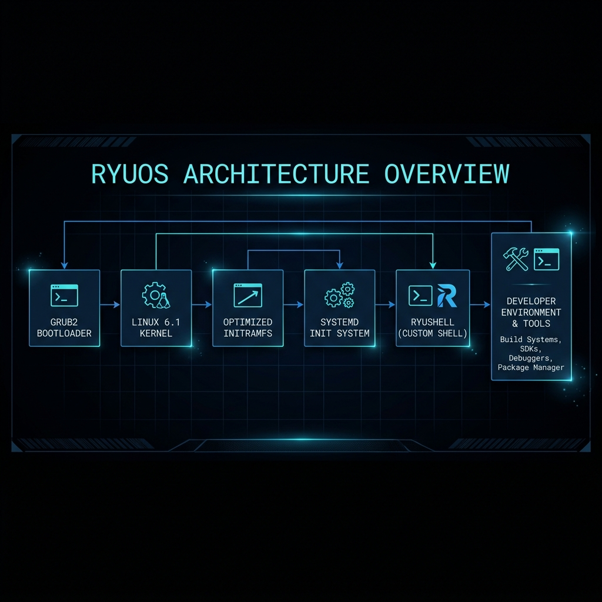

## Screenshots Showcase

Here are some live screenshots of RyuOS running in virtualization (QEMU & VirtualBox):

### Desktop Environment & System Telemetry
*Running the custom system telemetry tool (`sys-monitor`) alongside the Brave Browser inside VirtualBox.*
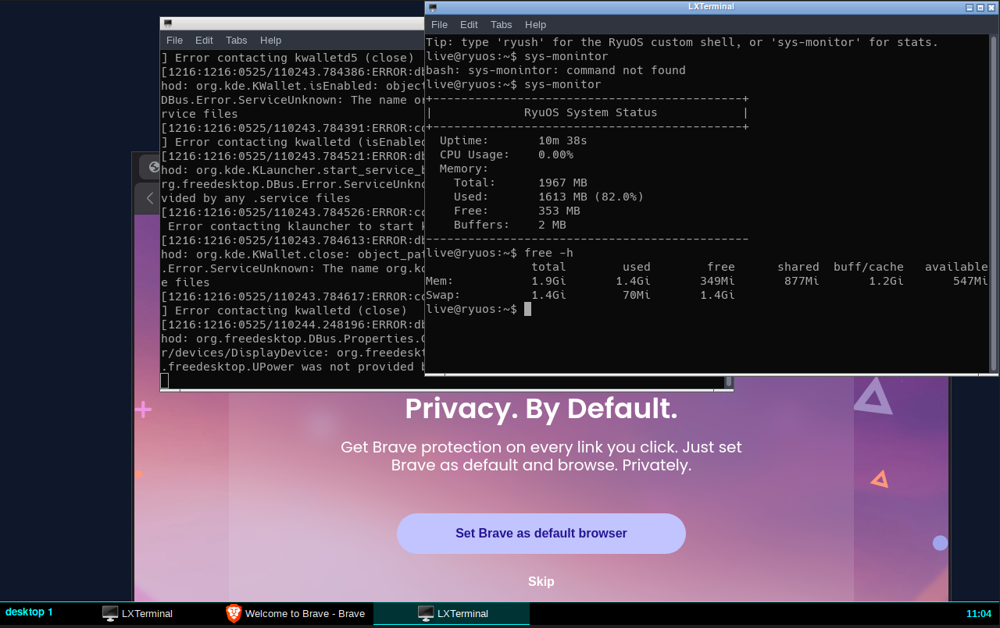

### Persistent Virtual Storage Setup
*Formatting, mounting, and verifying a secondary 10GB virtual storage disk (`/dev/vda` or `/dev/sda`) for additional software installation.*
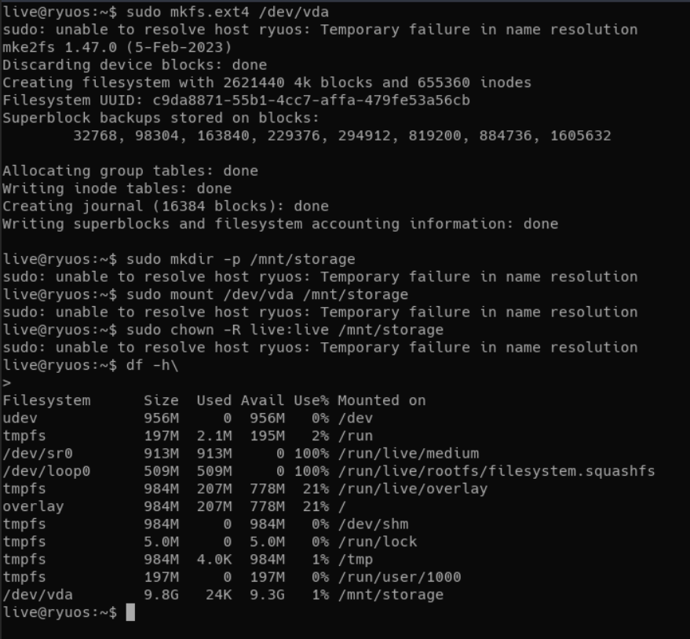

### Desktop App Compatibility (Java & Web)
*Running a Java desktop application (SKlauncher) successfully on top of RyuOS.*
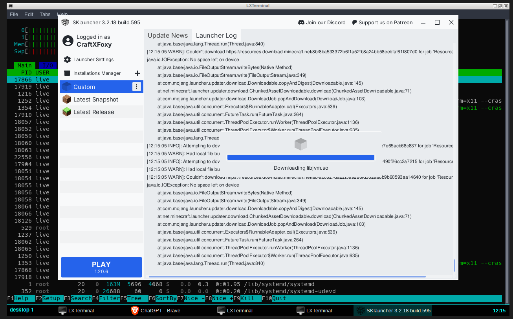

### Resource Management Under Load
*Htop showing system telemetry while running both Brave Browser (with ChatGPT) and a Java application within a 2GB RAM footprint.*
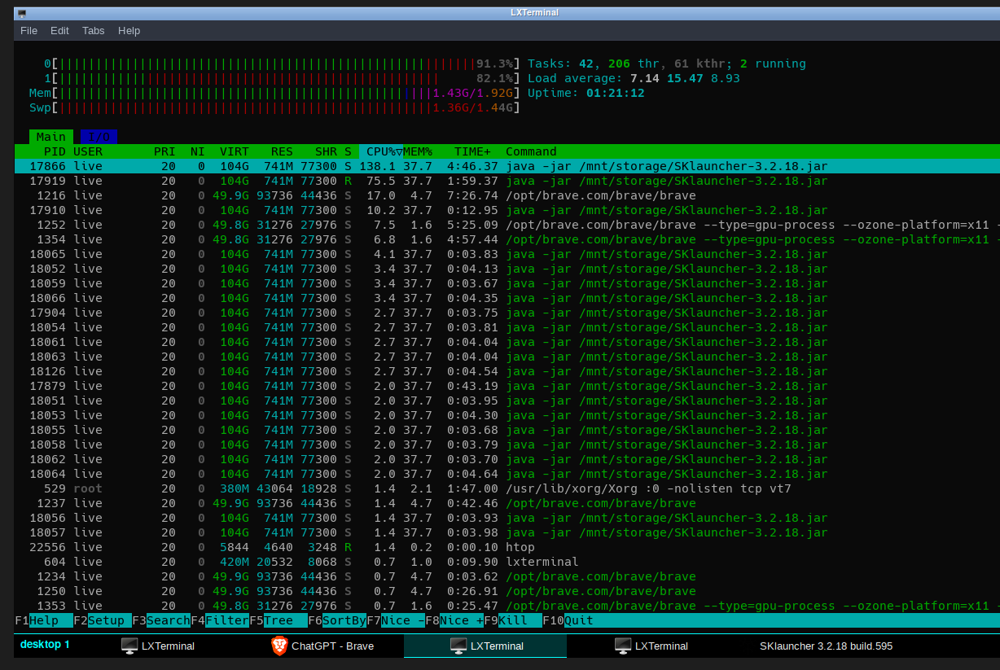

### Extremely Low Idle Footprint
*Showing RyuOS idling at just ~62MB of RAM usage within a 1GB environment.*
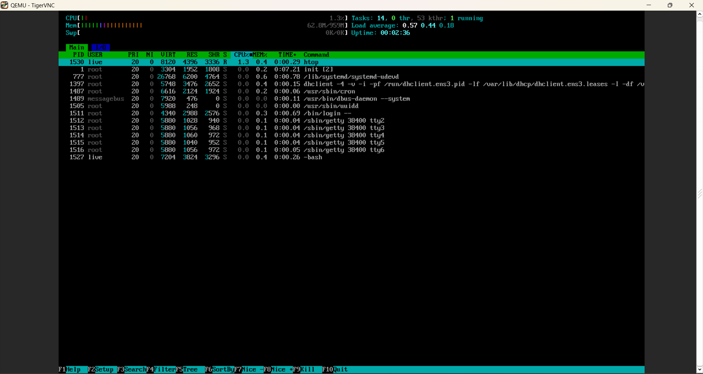

### Clean Boot & Login Sequence
*The initialization process loading the custom services and dropping to the login prompt.*
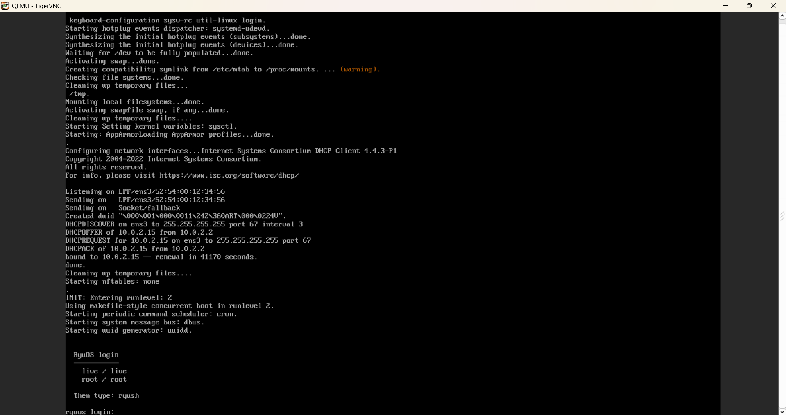

### Developer Environment
*The pre-configured GNU Bash terminal ready for systems programming.*
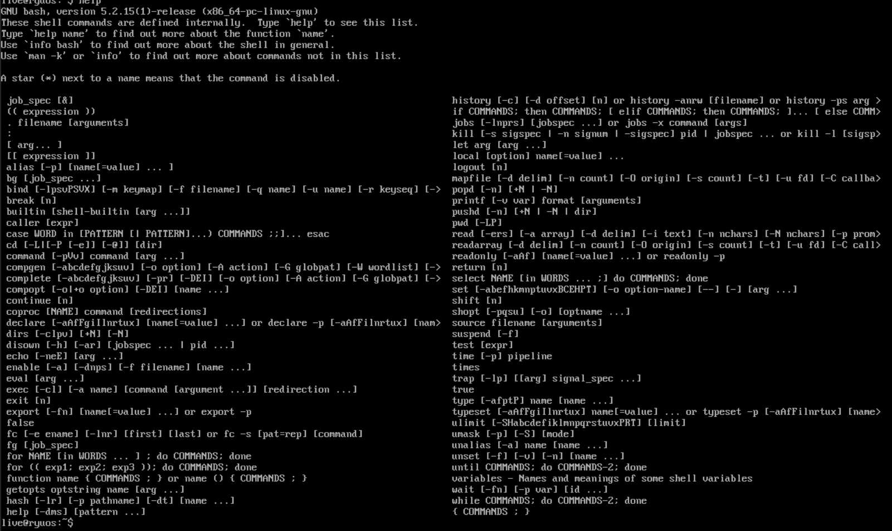


## Building from Source

To compile the exact same ISO yourself, you will need a Debian/Ubuntu host (or WSL2) with `live-build` and `make` installed.

### Build Steps

We provide two ways to build RyuOS: natively (requires root) or via Docker (safer, isolates dependencies).

#### Option A: Docker Build (Recommended)
Building via Docker prevents you from needing to run `live-build` as root on your host machine.
```bash
# 1. Clone the repository
git clone https://github.com/SHAURYASANYAL3/RyuOS.git
cd RyuOS

# 2. Build the ISO safely inside a container
make docker-iso
```

#### Option B: Native Build (Requires Debian/Ubuntu host)
```bash
# 1. Clone the repository
git clone https://github.com/SHAURYASANYAL3/RyuOS.git
cd RyuOS

# 2. Setup the dependencies (Requires root)
sudo make setup

# 3. Compile the ISO (Requires root for chroot execution)
sudo make iso
```

The resulting ISO will be placed in `iso/ryuos-cli.iso`.

## Development & Contribution

We welcome contributions! 
- Run `make lint` to ensure your bash scripts pass ShellCheck.
- Run `make test` to verify your local QEMU build works.
- Check out our [Roadmap](docs/roadmap.md) to see upcoming features (like AI Terminal integrations).
- Read our [Security Guidelines](docs/security.md) before submitting a PR.

## Tested RAM Configurations

To determine the performance boundaries of RyuOS, we actively benchmarked and tested the live environment across various memory constraints:

### 1. 256 MB RAM — Hard Floor (Kernel Panic)
*At 256MB RAM, the Linux kernel fails to unpack the compressed initramfs image, leading to a memory deadlock panic during early boot.*
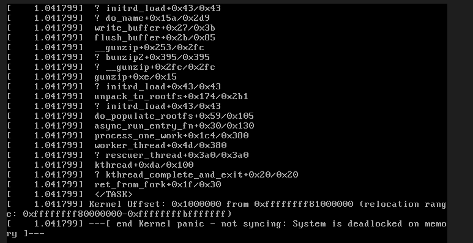

### 2. 384 MB RAM — Absolute Minimum Bootable RAM
*The system successfully decompresses and boots into the Openbox desktop environment. Running the custom `ryu-benchmark` tool reports 169MB used out of 331MB total.*
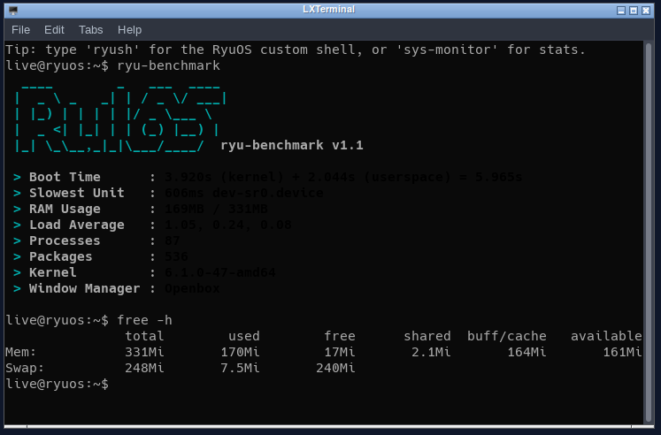

### 3. 512 MB RAM — Lightweight Desktop Profile
*Standard low-spec baseline. The desktop environment runs smoothly, with `ryu-benchmark` reporting 168MB used out of 457MB total.*
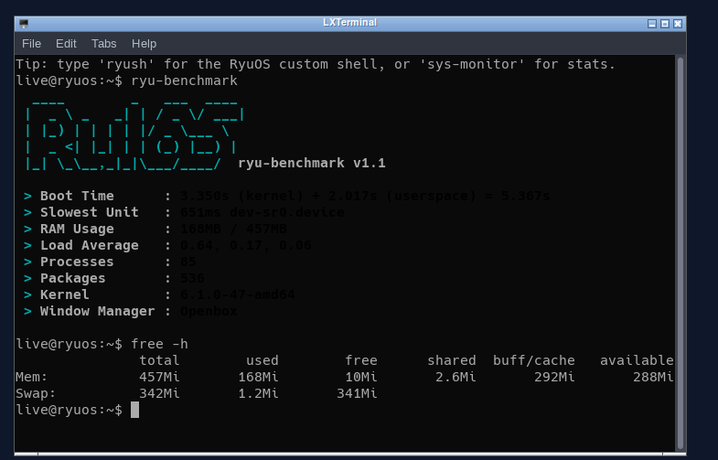

### 4. 1 GB RAM — Recommended Baseline Configuration
*Decompresses and boots with high stability. Highly stable, with ample room for systems programming, terminal tools, and lightweight development.*

### 5. 2 GB RAM — Power User & Multi-App Graphical Profile
*Provides full GUI multitasking headroom. Tested running Brave Browser (loading ChatGPT) and a Java desktop app (SKlauncher) concurrently under load.*


## Known Limitations
- The default QEMU smoke test uses 1024MB RAM for build/debug headroom; the runtime profile is tuned for 512MB-class live sessions.
- Graphics drivers (GPU/Media) are temporarily stripped during initramfs generation to save space, but are restored in the final filesystem.

## License
MIT License - see [LICENSE](LICENSE)
